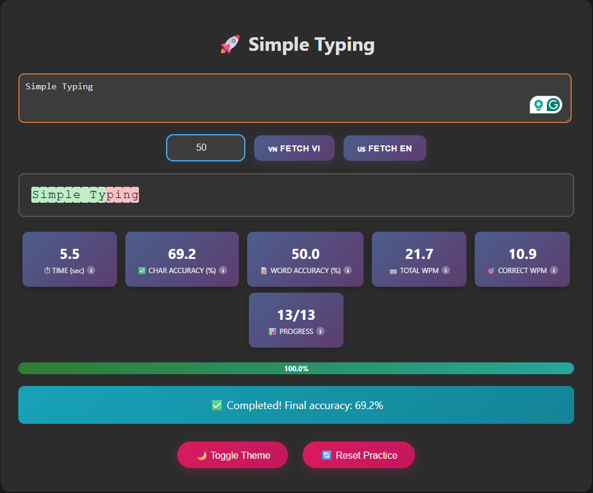

# Real-time Typing Practice

A (really small) web-based tool to enhance typing skills with real-time feedback.

Use the tool [Simple Typing](https://mrzaizai2k.github.io/typing.html)

## Features
- Tracks time (seconds), accuracy (%), words per minute (WPM), and progress.
- Highlights correct, incorrect, and current characters with color coding.
- Real-time progress bar and completion message.
- Customizable reference text input.
- Auto-scrolls to current typing position.
- Reset button to restart practice.

## Demo

